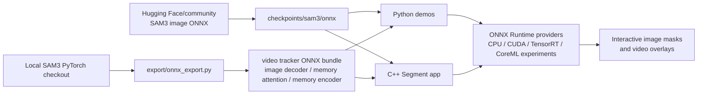
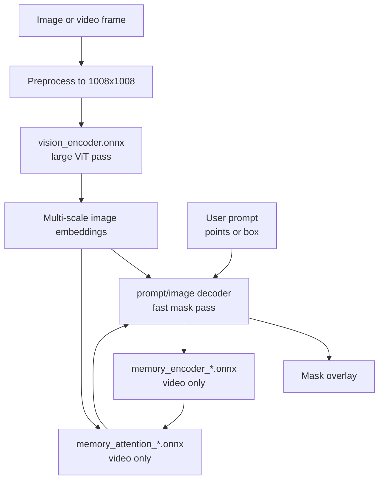

# sam3-onnx-cpp

SAM3 ONNX demos for Python and C++.

This repository shows the SAM3 image ONNX path and the SAM3 tracker/video ONNX
path through ONNX Runtime. It is intended for quick demos, smoke tests, and
experiments around exporting SAM3 pieces into ONNX/C++.

Important distinction:

- Image demos use the downloaded Hugging Face/community ONNX pair.
- Video demos use that downloaded vision encoder plus tracker modules exported by this repo.
- The ONNX image demo is a low-level prompt-head demo, not a full production SAM3 quality comparison.

For live CPU demos, keep video very short with `--max_frames 10` or `--max_frames 20`.

## Table Of Contents

- [How The Pieces Fit](#how-the-pieces-fit)
- [ONNX Export Strategy](#onnx-export-strategy)
- [Why ONNX?](#why-onnx)
- [Repository Layout](#repository-layout)
- [Demo Controls](#demo-controls)
- [Artifacts](#artifacts)
- [macOS Workflow](#macos-workflow)
- [Windows Workflow](#windows-workflow)
- [Runtime Variables](#runtime-variables)
- [Quality And Performance Notes](#quality-and-performance-notes)
- [Known Issues And Next Steps](#known-issues-and-next-steps)
- [Native Reference Demo](#native-reference-demo)
- [License](#license)

## How The Pieces Fit



SAM3 in this repo is intentionally split. The image ONNX pair is downloaded, and
the video tracker modules are exported locally from a SAM3 checkout. Python and
C++ are thin frontends over the same ONNX contracts.



## ONNX Export Strategy

SAM3 uses a hybrid export strategy in this repo. The image path starts from the
Hugging Face/community ONNX artifacts because those already provide a working
`vision_encoder.onnx` and `prompt_encoder_mask_decoder.onnx` pair. The local
export script focuses on the pieces that are still needed for video tracking:

- `image_decoder_*.onnx`: turns point prompts and image embeddings into masks
  and object pointers for the video tracker.
- `image_decoder_mask_*.onnx`: uses the same tracker head but also exposes
  `mask_inputs` as a dense mask prompt for painted-mask or prior-mask
  conditioning. Keeping this as a separate graph lets video propagation
  preserve the original no-mask tracker contract on propagation frames.
- `memory_attention_*.onnx`: fuses the current frame with previous mask memory.
- `memory_encoder_*.onnx`: converts a predicted mask back into memory for later
  frames.
- `video_constants_*.npz`: stores tracker constants that the runtime needs
  alongside the ONNX graphs.

The standalone download helpers fetch those hosted image ONNX artifacts from a
frozen `onnx-community/sam3-tracker-ONNX` revision:

```text
429305c8a5b3de597243d919a07e4e6bdcd00ef7
```

The rationale is practical portability. SAM3 has more export-sensitive internals
than SAM2, especially around tracker attention and rotary position handling, so
the repo avoids re-exporting working image artifacts and concentrates the custom
ONNX work on the video tracker contracts. Python and C++ then consume the same
artifacts without depending on PyTorch at demo time.

## Why ONNX?

Native PyTorch or Transformers remains the best reference path for model
development and quality comparisons. The ONNX path is useful when the goal is a
portable runtime:

- Python ONNX acts as a validation harness before the same artifacts are loaded
  from C++.
- Python and C++ use the same `.onnx` model contracts, reducing drift between
  prototype and native app.
- Demo/deployment machines do not need the full SAM3 Python stack at runtime.
- ONNX Runtime offers a common API for CPU, CUDA, TensorRT, DirectML, and future
  CoreML experiments.
- Splitting the model into encoder, decoder, memory attention, and memory
  encoder makes bottlenecks visible and easier to optimize.

## Repository Layout

```text
sam3-onnx-cpp/
|-- checkpoints/
|   `-- sam3/
|       |-- onnx/
|       `-- video_onnx/
|-- cpp/
|   |-- CMakeLists.txt
|   `-- src/
|-- export/
|   |-- onnx_export.py
|   `-- src/
|-- python/
|   |-- onnx_test_image.py
|   |-- onnx_test_video.py
|   |-- inspect_onnx_io.py
|   `-- api_test_image.py
|-- fetch_onnx_models.bat
|-- fetch_onnx_models.sh
`-- README.md
```

## Demo Controls

Seed points:

- Left click: foreground point
- Right click: background point
- Middle click: clear
- `Enter` or `Esc`: accept/continue in video prompt windows
- `Esc`: quit image windows

Bounding box:

- Drag left mouse button: draw box
- Right click or double click: clear
- `Enter` or `Esc`: accept/continue in video prompt windows
- `Esc`: quit image windows

If `--image` or `--video` is omitted, the demo opens a file selector.

## Artifacts

Downloaded image ONNX files live in:

```text
checkpoints/sam3/onnx/
```

Expected FP32 files:

```text
vision_encoder.onnx
vision_encoder.onnx_data
prompt_encoder_mask_decoder.onnx
prompt_encoder_mask_decoder.onnx_data
```

Optional FP16 files:

```text
vision_encoder_fp16.onnx
vision_encoder_fp16.onnx_data
prompt_encoder_mask_decoder_fp16.onnx
prompt_encoder_mask_decoder_fp16.onnx_data
```

Optional CPU INT8 encoder file:

```text
vision_encoder.int8.onnx
vision_encoder.int8.onnx.data
```

When this file exists, the C++ CPU resolver prefers it for the image/video
encoder and keeps the decoder/tracker modules at fp32 unless explicitly
overridden.

Exported video tracker files live in:

```text
checkpoints/sam3/video_onnx/
```

Expected FP32 files:

```text
image_decoder_single.onnx
image_decoder_mask_single.onnx
memory_attention_single.onnx
memory_encoder_single.onnx
video_constants_single.npz
image_decoder_multi.onnx
image_decoder_mask_multi.onnx
memory_attention_multi.onnx
memory_encoder_multi.onnx
video_constants_multi.npz
```

The exported `image_decoder_mask_*` input contract is:

```text
point_coords
point_labels
image_embed
high_res_feats_0
high_res_feats_1
mask_inputs
```

`mask_inputs` is shaped as a single-channel prompt mask
`[1, 1, 288, 288]` at SAM3's prompt-mask resolution for the standard
`1008x1008` image size. The regular `image_decoder_*` files intentionally keep
the five-input point-prompt contract used by standard video propagation.

## macOS Workflow

These commands assume Apple Silicon with Homebrew in `/opt/homebrew`.

### 1. Create the Python environment

```bash
cd /Users/pgarcia/Documents/sam3-onnx-cpp
python3 -m venv sam3_env
source sam3_env/bin/activate
python -m pip install --upgrade pip
python -m pip install onnxruntime opencv-python PyQt5 numpy
```

For exporting tracker modules from a local SAM3 checkout, also install:

```bash
python -m pip install torch torchvision onnx onnxscript huggingface_hub timm ftfy iopath einops setuptools
python -m pip install -e ../sam3
```

### 2. Download image ONNX files

```bash
chmod +x fetch_onnx_models.sh
./fetch_onnx_models.sh fp32
```

Optional CUDA/FP16 artifacts:

```bash
./fetch_onnx_models.sh fp16
```

Optional CPU INT8 encoder artifact:

```bash
python -m pip install onnx sympy
python python/quantize_image_models.py --model encoder --preprocess
```

### 3. Export video tracker modules

The exporter expects a local SAM3 checkout next to this repo:

```text
/Users/pgarcia/Documents/sam3
/Users/pgarcia/Documents/sam3-onnx-cpp
```

Tracker exports are pinned to the official Meta pre-SAM 3.1 source revision:

```text
86ed77094094e5cabb16b0414ec60c5ba9ce0a0f
Meta SAM3 pre-3.1, 2026-03-16, before SAM 3.1 Object Multiplex
```

Before exporting, put the sibling SAM3 checkout at that exact revision:

```bash
python python/fetch_sam3_repo.py
```

`export/onnx_export.py` verifies this revision by default and aborts on a
mismatch. Use `--sync-sam3-repo` if the exporter should fetch and checkout the
pinned revision before export. Use `--allow-sam3-revision-mismatch` only for
deliberate experiments.

On a CPU-only Mac, fp32-only export is the clean path:

```bash
source sam3_env/bin/activate
python export/onnx_export.py \
  --sam3-repo ../sam3 \
  --load-from-hf \
  --precisions fp32
```

If the upstream SAM3 checkout assumes CUDA during model construction, patch those
construction-time tensors to use CUDA when available and CPU otherwise. The needed
change is not macOS-specific; it is CPU portability for non-CUDA machines.

### 4. Inspect the ONNX models

```bash
source sam3_env/bin/activate
python python/inspect_onnx_io.py
```

### 5. Run Python image demos

```bash
source sam3_env/bin/activate

python python/onnx_test_image.py \
  --prompt seed_points \
  --safe

python python/onnx_test_image.py \
  --prompt bounding_box \
  --safe
```

To avoid the file selector:

```bash
python python/onnx_test_image.py \
  --prompt bounding_box \
  --safe \
  --image /Users/pgarcia/Downloads/kodak_pictures/kodim10.png
```

Expected CPU behavior:

- Vision encoder: several seconds
- Prompt decoder: tens of milliseconds

### 6. Run Python video demos

The video tracker uses the exported `video_onnx` bundle. On CPU, disable graph
optimizations with `--safe` and keep the frame count tiny:

```bash
SAM3_ORT_ACCEL=cpu SAM3_ONNX_VARIANT=fp32 SAM3_ORT_TRACKER_PRECISION=fp32 \
python python/onnx_test_video.py \
  --prompt bounding_box \
  --max_frames 10 \
  --safe
```

To avoid the file selector:

```bash
SAM3_ORT_ACCEL=cpu SAM3_ONNX_VARIANT=fp32 SAM3_ORT_TRACKER_PRECISION=fp32 \
python python/onnx_test_video.py \
  --video /Users/pgarcia/Downloads/video_sample.mp4 \
  --box 120,80,520,430 \
  --max_frames 10 \
  --safe
```

### 7. Build C++ on macOS

Install OpenCV with Homebrew:

```bash
brew install opencv
```

Download or unpack ONNX Runtime for macOS arm64, then point CMake at it. Example:

```bash
cd /Users/pgarcia/Documents/sam3-onnx-cpp/cpp

cmake -S . -B build_release \
  -DOpenCV_DIR="$(brew --prefix opencv)/lib/cmake/opencv4" \
  -DONNXRUNTIME_DIR="/opt/onnxruntime-osx-arm64-1.23.2"

cmake --build build_release --target Segment --clean-first
cmake --install build_release --prefix package
```

The packaged app is:

```text
cpp/package/Segment.app/Contents/MacOS/Segment
```

### 8. Run C++ demos on macOS

```bash
cd /Users/pgarcia/Documents/sam3-onnx-cpp
SEG=cpp/package/Segment.app/Contents/MacOS/Segment
```

Image:

```bash
SAM3_ONNX_VARIANT=fp32 "$SEG" --onnx_test_image \
  --prompt seed_points \
  --device cpu \
  --threads 4

SAM3_ONNX_VARIANT=fp32 "$SEG" --onnx_test_image \
  --prompt bounding_box \
  --device cpu \
  --threads 4
```

Video:

```bash
SAM3_ORT_GRAPH_OPT=disable SAM3_ONNX_VARIANT=fp32 SAM3_ORT_TRACKER_PRECISION=fp32 \
"$SEG" --onnx_test_video \
  --prompt bounding_box \
  --max_frames 10 \
  --device cpu \
  --threads 4
```

Noninteractive smoke tests:

```bash
SAM3_ONNX_VARIANT=fp32 "$SEG" --onnx_test_image \
  --no_gui \
  --image ../sam3/assets/images/truck.jpg \
  --box 90,55,230,185 \
  --device cpu \
  --threads 4 \
  --save_overlay /tmp/sam3_cpp_image.png

SAM3_ORT_GRAPH_OPT=disable SAM3_ONNX_VARIANT=fp32 SAM3_ORT_TRACKER_PRECISION=fp32 \
"$SEG" --onnx_test_video \
  --video /Users/pgarcia/Downloads/video_sample.mp4 \
  --box 120,80,520,430 \
  --max_frames 10 \
  --device cpu \
  --threads 4 \
  --output /tmp/sam3_cpp_video.avi
```

## Windows Workflow

Run these from PowerShell.

### 1. Create the Python environment

```powershell
cd C:\path\to\sam3-onnx-cpp
python -m venv sam3_env
.\sam3_env\Scripts\Activate.ps1
python -m pip install --upgrade pip
python -m pip install onnxruntime opencv-python PyQt5 numpy
```

For export/native comparison:

```powershell
python -m pip install torch torchvision onnx onnxscript huggingface_hub timm ftfy iopath einops setuptools
python -m pip install -e ..\sam3
```

For ONNX Runtime CUDA:

```powershell
python -m pip uninstall -y onnxruntime
python -m pip install onnxruntime-gpu
```

On Pascal/Volta-era GPUs, such as TITAN X Pascal, the newest
`onnxruntime-gpu` CUDA 12/cuDNN 9 wheels may expose `CUDAExecutionProvider`
but fail at runtime with cuDNN frontend errors such as `no kernel image is
available for execution on the device`. Use the CUDA 11/cuDNN 8 stack and fp32
tracker models instead:

```powershell
python -m pip uninstall -y onnxruntime onnxruntime-gpu
python -m pip install onnxruntime-gpu==1.18.0 nvidia-cudnn-cu11==8.9.5.29
$env:SAM3_ORT_ACCEL = "cuda"
$env:SAM3_ORT_TRACKER_PRECISION = "fp32"
```

### 2. Download image ONNX files

```powershell
.\fetch_onnx_models.bat fp32
```

Optional CUDA/FP16 artifacts:

```powershell
.\fetch_onnx_models.bat fp16
```

Optional CPU INT8 encoder artifact:

```powershell
python -m pip install onnx sympy
python .\python\quantize_image_models.py --model encoder --preprocess
```

### 3. Export video tracker modules

Use a local SAM3 checkout next to this repo:

```text
C:\path\to\sam3
C:\path\to\sam3-onnx-cpp
```

CPU/fp32 export:

```powershell
.\sam3_env\Scripts\python.exe .\export\onnx_export.py `
  --sam3-repo "..\sam3" `
  --load-from-hf `
  --precisions fp32
```

CUDA machines can export both fp32 and fp16:

```powershell
.\sam3_env\Scripts\python.exe .\export\onnx_export.py `
  --sam3-repo "..\sam3" `
  --load-from-hf
```

### 4. Run Python image demos on Windows

```powershell
.\sam3_env\Scripts\python.exe .\python\onnx_test_image.py `
  --prompt seed_points `
  --safe

.\sam3_env\Scripts\python.exe .\python\onnx_test_image.py `
  --prompt bounding_box `
  --safe
```

To avoid the file selector:

```powershell
.\sam3_env\Scripts\python.exe .\python\onnx_test_image.py `
  --image "C:\path\to\image.png" `
  --prompt bounding_box `
  --safe
```

### 5. Run Python video demos on Windows

CPU:

```powershell
$env:SAM3_ORT_ACCEL = "cpu"
$env:SAM3_ONNX_VARIANT = "fp32"
$env:SAM3_ORT_TRACKER_PRECISION = "fp32"

.\sam3_env\Scripts\python.exe .\python\onnx_test_video.py `
  --prompt bounding_box `
  --max_frames 10 `
  --safe
```

CUDA, when the CUDA provider is installed and working:

```powershell
$env:SAM3_ORT_ACCEL = "cuda"
$env:SAM3_ONNX_VARIANT = "fp16"
$env:SAM3_ORT_TRACKER_PRECISION = "fp16"

.\sam3_env\Scripts\python.exe .\python\onnx_test_video.py `
  --prompt bounding_box `
  --max_frames 10
```

### 6. Build C++ on Windows

Install:

- Visual Studio 2022 with C++ tools
- CMake
- OpenCV
- ONNX Runtime for Windows

Configure and build:

```powershell
cd C:\path\to\sam3-onnx-cpp\cpp

cmake -S . -B build_release -G "Visual Studio 17 2022" -A x64 `
  -DCMAKE_CONFIGURATION_TYPES=Release `
  -DOpenCV_DIR="C:\path\to\opencv\build" `
  -DONNXRUNTIME_DIR="C:\path\to\onnxruntime-win-x64-1.23.2"

cmake --build .\build_release --config Release --target Segment -- /m:1
```

For GPU deployment, point `ONNXRUNTIME_DIR` at an ONNX Runtime GPU package and make
sure CUDA/cuDNN runtime DLLs are available to the executable.

### 7. Run C++ demos on Windows

From the repo root:

```powershell
$seg = ".\cpp\build_release\bin\Release\Segment.exe"
```

Image:

```powershell
$env:SAM3_ONNX_VARIANT = "fp32"

& $seg --onnx_test_image `
  --prompt seed_points `
  --device cpu `
  --threads 8

& $seg --onnx_test_image `
  --prompt bounding_box `
  --device cpu `
  --threads 8
```

Video:

```powershell
$env:SAM3_ORT_GRAPH_OPT = "disable"
$env:SAM3_ONNX_VARIANT = "fp32"
$env:SAM3_ORT_TRACKER_PRECISION = "fp32"

& $seg --onnx_test_video `
  --prompt bounding_box `
  --max_frames 10 `
  --device cpu `
  --threads 8
```

Noninteractive smoke tests:

```powershell
& $seg --onnx_test_image `
  --no_gui `
  --image "..\sam3\assets\images\truck.jpg" `
  --box 90,55,230,185 `
  --device cpu `
  --threads 8 `
  --save_overlay ".\tmp\sam3_cpp_image.png"

& $seg --onnx_test_video `
  --video "C:\path\to\video.mp4" `
  --box 120,80,520,430 `
  --max_frames 10 `
  --device cpu `
  --threads 8 `
  --output ".\tmp\sam3_cpp_video.avi"
```

## Runtime Variables

| Variable | Values | Use |
| --- | --- | --- |
| `SAM3_ORT_ACCEL` | `auto`, `cpu`, `cuda`, `trt` | Python provider selection. |
| `SAM3_ONNX_VARIANT` | `auto`, `int8`, `fp32`, `fp16` | C++ image encoder/decoder precision fallback. |
| `SAM3_ORT_ENCODER_VARIANT` | `auto`, `int8`, `fp32`, `fp16` | C++ image/video encoder precision override. |
| `SAM3_ORT_DECODER_VARIANT` | `auto`, `int8`, `fp32`, `fp16` | C++ image prompt decoder precision override. |
| `SAM3_ORT_TRACKER_PRECISION` | `auto`, `fp32`, `fp16` | Video tracker precision. |
| `SAM3_ORT_GRAPH_OPT` | `disable`, `basic`, `extended`, `all` | C++/Python graph optimization override. |
| `SAM3_ORT_ENCODER_GRAPH_OPT` | `disable`, `basic`, `extended`, `all` | C++ per-role override for the vision encoder session; takes precedence over `SAM3_ORT_GRAPH_OPT`. On DML the encoder now defaults to normal optimizations while tracker graphs keep safe mode. |
| `SAM3_ORT_TRACKER_GRAPH_OPT` | `disable`, `basic`, `extended`, `all` | C++ per-role override for tracker sessions (decoder, memory attention, memory encoder); takes precedence over `SAM3_ORT_GRAPH_OPT`. On DML the tracker default is `basic` (bisect-validated bit-identical); `extended`/`all` altered fp16 masks and remain opt-in. |
| `SAM3_ORT_WARMUP` | `auto`, `on`, `off`, `full` | C++ video warm-up after `initializeVideo`. `auto` warms tracker modules on non-CPU devices; `full` also runs one dummy encoder pass. |
| `SAM3_ORT_CPU_THREADS` | integer, including `0` | C++ CPU thread override; `0` leaves ORT intra-op threads at its default. |
| `SAM3_ORT_INTRA_OP_THREADS` | integer, including `0` | Python ORT thread override, and C++ fallback when `SAM3_ORT_CPU_THREADS` is unset. |
| `SAM3_ORT_IO_BINDING` | `auto`, `0`, `1` | Python I/O binding override. |
| `SAM3_ORT_ENCODER_CACHE_PRECISION` | `auto`, `fp16`, `fp32` | C++ host embedding-cache storage. `auto` keeps FP32/INT8 encoder outputs exact and compresses only FP16 encoder outputs. |
| `SAM3_ORT_PROPAGATION_IO_BINDING` | `0`, `1` | Experimental C++ CUDA-only `fused_feat` handoff from memory attention to the tracker decoder. Off by default and automatically falls back to ordinary `Run`. |

## C++ Tensor Input

Downstream C++ callers that already produce the SAM3 encoder input tensor can bypass the wrapper image resize/planar conversion step:

```cpp
const SAM3Size modelInput = sam.getInputSize();
std::vector<float> nchw(1 * 3 * modelInput.height * modelInput.width);

Image<float> mask = sam.inferMultiFrameTensor(
    nchw,
    SAM3Size{originalWidth, originalHeight},
    prompts);
```

The tensor must match the encoder input shape exactly, normally `1 x 3 x H x W`, and use the same normalized RGB layout as the demo preprocessing.

## C++ Tracker State And CUDA Experiment

Tracker memory frames are immutable shared states. Memory snapshots therefore
copy small handles rather than duplicating the `64 x 72 x 72` feature tensors,
and confidence-only consumers should call `lastTrackerFrameMetrics()` instead
of copying `lastTrackerFrameState()`.

The tracker retains multiple conditioning frames and selects at most
`max_cond_frames_in_attn`, preferring the first frame when the exported
`keep_first_cond_frame` constant asks for it and otherwise the closest frames.
Static ONNX memory-slot counts remain the hard upper bound.

`SAM3_ORT_PROPAGATION_IO_BINDING=1` is a benchmark-gated CUDA experiment. It is
used only when the memory-attention graph exposes exactly one output named
`fused_feat` with the expected current-vision shape. Binding or downstream
decoder failure disables it for the remaining run and repeats the frame with
ordinary host-output `Run` calls. Diagnostics report requested/used/fallback.

The decoder-to-memory-encoder edge is deliberately not device-bound yet:
multimask candidate selection may replace the selected high-resolution logits,
and persistent tracker history is currently stored on the host. A fused static
propagation graph may ship only after CPU/CUDA output parity, multi-conditioning
parity, cancellation, and cache-hot volume benchmarks pass. Do not treat graph
fusion alone as an optimization without those measurements.

## Quality And Performance Notes

- CPU inference is supported, but the SAM3 vision encoder is large.
- For CPU C++, generate `vision_encoder.int8.onnx` to reduce encoder latency.
  Validate mask quality on your target prompts before shipping it; dynamic INT8
  quantization can change candidate scores and mask selection.
- Image prompting should feel interactive after the first encoder pass because decoder calls are much faster.
- The ONNX image demo exposes a low-level prompt-head path and chooses one of three masks by predicted IoU. This is not a full production SAM3 quality comparison.
- If the selected mask looks poor, try a different prompt or use the native SAM3 reference path for comparison.
- On CPU video, use `--safe` in Python and `SAM3_ORT_GRAPH_OPT=disable` in C++ to avoid aggressive ORT graph rewrites on the exported tracker modules.
- Keep live CPU video demos to `2` or `3` frames.

## Known Issues And Next Steps

- macOS is currently CPU-first. ONNX Runtime may list CoreML as an available
  provider, but the SAM3 Python and C++ paths still need a validated CoreML
  integration. The first useful target is encoder acceleration.
- SAM3 video on CPU is slow because the 1008x1008 vision encoder and memory
  attention are expensive. CUDA, TensorRT, FP16 tracker artifacts, and I/O
  binding are the main acceleration paths to harden next.
- The repo intentionally uses a hybrid image strategy: downloaded
  Hugging Face/community image ONNX artifacts plus locally exported video
  tracker modules. A future milestone is a fully reproducible local image export
  once the remaining export-sensitive SAM3 internals are handled cleanly.
- Some tracker graphs are sensitive to ONNX Runtime graph optimization. For now,
  use `--safe` in Python or `SAM3_ORT_GRAPH_OPT=disable` in C++ when needed;
  future work should identify the smallest graph changes needed to make higher
  optimization levels reliable.
- The macOS C++ package depends on Homebrew OpenCV and local ONNX Runtime dylibs.
  A proper redistributable app should bundle or relink those dependencies.
- The Windows CUDA path should be kept in parity with macOS using the same
  noninteractive image and short-video smoke tests.

## Native Reference Demo

The native reference path uses the sibling `../sam3` checkout and enforces the
same pre-SAM 3.1 source revision used by the ONNX exporter:

```bash
python python/api_test_image.py --prompt seed_points
```

On Windows:

```powershell
.\sam3_env\Scripts\python.exe .\python\api_test_image.py --prompt seed_points
```

## License

See [LICENSE](LICENSE).
